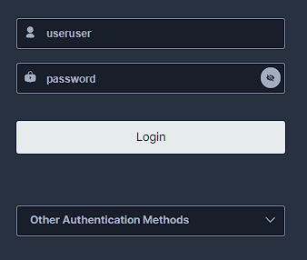

# Project launch

1. Преименовать .env.example в .env

## Production

1. Прописать команду `docker-compose up --build -d`
### PostgreSQL миграции
1. Прописать команду `pip install alembic`
2. Прописать команду `cd ./app`
3. Прописать команду `alembic upgrade head`
### MinIO

К сожалению, я не успел прописать рабочий bash

http://localhost:9000/ \
\
(MINIO_ROOT_USER в .env) login: useruser\
(MINIO_ROOT_PASSWORD в .env) password: password

http://localhost:9001/access-keys \
\
(MINIO_ACCESS_KEY в .env) access key: 5FOzxsupJPQRbPfc87kh \
(MINIO_SECRET_KEY в .env) secret key: GzVUnOLcdxV4pWTMCik5MROVs6hoIIbCnaPuXKzJ

http://localhost:9001/buckets \
 \
Создать bucket **prize** \
Создать bucket **user**

## Mock
1. Dependency installation`pip install -r requirements.txt`
2. Start a web server: `python cli.py game`
3. Start a dev web server: `python cli.py game --reload`
## API with database 
1. Execute the command `docker-compose up --build -d` 
2. Execute the command `alembic upgrade head` from directory `./app` - table migration
